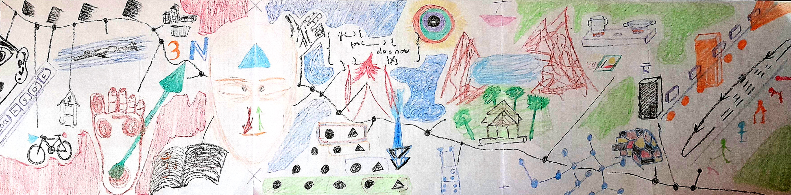

* [About Me](aboutMe)

# Blogs

Arranged in chronological order. To view by tags click [here]({{ site.github.repository_url }}/tags)

<ul class="post-list">
  
    <li>
      <a class="post-list-title" href="{{ site.github.repository_url }}{{ post.url }}">{{ post.title }}</a>
      

        <time datetime="{{ post.date | date_to_xmlschema }}">{{ post.date | date: "%b %-d, %Y" }}</time>
        
          <a class="tag" href="tags#{{ tag }}">{{ tag }}</a>
        
      

      
        
{{ post.desc }}

      
    </li>
  
</ul>

---

* Note: Most of these blogs were first published on Google's blogger have been ported
  to Github for my love towards
  [Markdown](https://daringfireball.net/projects/markdown/),
  [Git](https://git-scm.com/), [vimwiki](https://vimwiki.github.io/)

---
Except where otherwise noted, contents are licensed under a [Creative Commons
Attribution 4.0](https://creativecommons.org/licenses/by/4.0/) International
license
----
